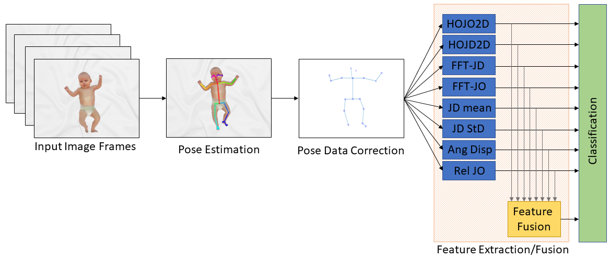

# Pose-basedCerebralPalsyPrediction

We present a series of new and improved features, and a feature fusion pipeline for this classification task. We also introduce the RVI-38 dataset, a series of videos captured as part of routine clinical care. By utilising this challenging dataset we establish the robustness of several motion features for classification, subsequently informing the design of our proposed feature fusion framework based upon the General Movements Assessment (GMA).

The features, classification framework and the dataset are presented in the article (see the Citation section). Since we are still preparing the final version of the article, the code will be available soon. Stay tuned!

For accessing the dataset (skeletal pose sequences with annotations), please contact Edmond S. L. Ho (e.ho@northumbria.ac.uk).

# Usage
The code was developed and tested on Matlab R2021b, and it should be runnable on some older Matlab versions.

The code can be used for extracting features and evaluating the classification performances on the MINI-RGBD and RVI-38 datasets.

**For MINI-RGBD:**
The extracted json pose data can be downloaded from https://drive.google.com/file/d/1BH9IDINlwuqWjTiK5V-CdMyASbooSviD/view?usp=sharing - extract the files and place them under MRGB/00_25J_MRGB/

To run the feature extraction run the A_Feature_Extraction_MRGBD.m, this will process the pose data and extract each of the proposed features for classification.

To run the classification pipeline, run the B_Classification_MRGBD.m

**For RVI-38:**
The extracted json pose data is available upon request, please contact Edmond S. L. Ho (e.ho@northumbria.ac.uk).

To run the feature extraction run the A_Feature_Extraction_RVI.m, this will process the pose data and extract each of the proposed features for classification.

To run the classification pipeline, run the B_Classification_RVI.m

# Citation
Please cite these papers in your publications if it helps your research:

    @ARTICLE{McCay:TNSRE2022,
        author={McCay, Kevin D. and Hu, Pengpeng and Shum, Hubert P. H. and Woo, Wai Lok and Marcroft, Claire and Embleton, Nicholas D. and Munteanu, Adrian and Ho, Edmond S. L.},
        journal={IEEE Transactions on Neural Systems and Rehabilitation Engineering}, 
        title={A Pose-Based Feature Fusion and Classification Framework for the Early Prediction of Cerebral Palsy in Infants}, 
        year={2022},
        volume={30},
        number={},
        pages={8-19},
        doi={10.1109/TNSRE.2021.3138185}}
    }
    
    @INPROCEEDINGS{McCay:EMBC2019,  
        author={McCay, Kevin D. and Ho, Edmond S. L. and Marcroft, Claire and Embleton, Nicholas D.},  
        booktitle={2019 41st Annual International Conference of the IEEE Engineering in Medicine and Biology Society (EMBC)},   
        title={Establishing Pose Based Features Using Histograms for the Detection of Abnormal Infant Movements},   
        year={2019},  
        pages={5469-5472},  
        doi={10.1109/EMBC.2019.8857680}
    }
    
You may also visit our project page for more related research: http://www.edho.net/projects/babies/

# Authors and Contributors
The program is developed by Kevin McCay (K.Mccay@mmu.ac.uk) and Edmond S. L. Ho (e.ho@northumbria.ac.uk). Currently, it is being maintained by Edmond S. L. Ho.
